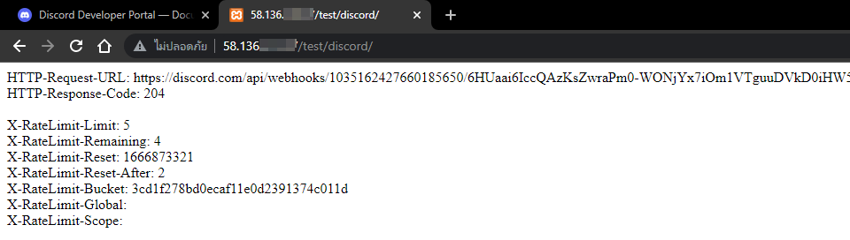

# azael_dc-serverlogs

คำถามที่พบบ่อยเกียวกับวิธีแก้ไขปัญหาของทรัพยากร **[azael_dc-serverlogs](../../script/azael_dc-serverlogs/index.md)**

## วิธีแก้ไข "event [name] was not safe for net"

หาก **[Server Console](https://docs.fivem.net/docs/server-manual/server-commands)** แสดงข้อความ `event [name] was not safe for net` จาก **[azael_dc-serverlogs](../../script/azael_dc-serverlogs/index.md)** สาเหตุเกิดจาก มีการใช้งาน **[รหัสส่งข้อมูลในเวอร์เวอร์ที่ล้าสมัย](../../script/azael_dc-serverlogs/config/server.md#eventhandlerenable)** ทางฝั่ง **[Client](https://en.wikipedia.org/wiki/Client-side)** และ มีความจำเป็นที่จะต้องดำเนินการแก้ไขเป็น **[รหัสส่งข้อมูลในรูปแบบใหม่](../../script/azael_dc-serverlogs/export/client.md)**

```js title="Server Console"
[script:azael_dc-serverlogs] event azael_dc-serverlogs:sendToDiscord was not safe for net
[script:azael_dc-serverlogs] event azael_dc-serverlogs:insertData was not safe for net
[script:azael_dc-serverlogs] event azael_discordlogs:sendToDiscord was not safe for net
```

#### วิธีการค้นหาและแก้ไข
- เปิดโฟลเดอร์ [**`resources`**](https://github.com/citizenfx/cfx-server-data/tree/master/resources) ด้วยโปรแกรม [**VS Code**](https://code.visualstudio.com/)
- ค้นหา **`TriggerServerEvent('azael_d`** จะพบรหัสที่ต้องดำเนินการแก้ไขเป็น [**รหัสส่งข้อมูลในรูปแบบใหม่**](../../script/azael_dc-serverlogs/export/client.md) ทางฝั่ง [**Client**](https://en.wikipedia.org/wiki/Client-side)

#### ตัวอย่างการแก้ไขรหัส

```lua title="ก่อนแก้ไข"
local sendToDiscord = '' .. GetPlayerName(PlayerId()) .. ' ซื้อรถ ' .. vehicleData.model .. ' ทะเบียน ' .. vehicleProps.plate .. ' ราคา $' .. ESX.Math.GroupDigits(vehicleData.price) ..''
TriggerServerEvent('azael_dc-serverlogs:sendToDiscord', 'BuyVehicle', sendToDiscord, GetPlayerServerId(PlayerId()), 2)
```

```lua title="หลังแก้ไข"
local sendToDiscord = '' .. GetPlayerName(PlayerId()) .. ' ซื้อรถ ' .. vehicleData.model .. ' ทะเบียน ' .. vehicleProps.plate .. ' ราคา $' .. ESX.Math.GroupDigits(vehicleData.price) ..''
-- TriggerServerEvent('azael_dc-serverlogs:sendToDiscord', 'BuyVehicle', sendToDiscord, GetPlayerServerId(PlayerId()), 2)

pcall(function()
    exports['azael_dc-serverlogs']:insertData({
        event = 'BuyVehicle',
        content = sendToDiscord,
        color = 2
    })
end)
```

:::tip

รหัสส่งข้อมูลทางฝั่ง **[Client](https://en.wikipedia.org/wiki/Client-side)** ไม่ต้องกำหนด **`source`** เพื่อรับ **ID** ของผู้เล่นปัจจุบัน ยกเว้นในกรณีที่ต้องการรับ **ID** ของผู้เล่นที่มีปฏิสัมพันธ์กับผู้เล่นปัจจุบัน ([**ดูข้อมูลเพิ่มเติม**](../../script/azael_dc-serverlogs/tutorial.md#ติดตั้งฝั่ง-client))

:::

## Discord Webhook ไม่ทำงาน (ดับทั้งหมด)

ไม่มีข้อมูลส่งมายังกลุ่ม **[Discord](https://discord.com/)** และ **[Webhooks](https://support.discord.com/hc/en-us/articles/228383668-Intro-to-Webhooks)** ไม่ทำงาน (ดับทั้งหมด) สาเหตุนี้เกิดจากเครื่องเซิร์ฟเวอร์ของคุณกำลังถูก **[Discord](https://discord.com/)** ระงับการใช้งาน **[API](https://discord.com/developers/docs/resources/webhook#execute-webhook)** (ติดสถานะ **[429 - Global Rate Limit](https://discord.com/developers/docs/topics/rate-limits#global-rate-limit)**) ซึ่งสาเหตุเกิดมาจากทรัพยากรภายในเซิร์ฟเวอร์ของคุณมีการใช้งาน **[Discord API](https://discord.com/developers/docs/resources/webhook#execute-webhook)** ที่ไม่เป็นไปตามเงื่อนไขการใช้งาน **[Rate Limits](https://discord.com/developers/docs/topics/rate-limits#rate-limits)** ของ **[Discord](https://discord.com/)**

:::tip

คุณสามารถตรวจสอบว่าเซิร์ฟเวอร์ของคุณกำลังติดสถานะ **[429 - Global Rate Limit](https://discord.com/developers/docs/topics/rate-limits#global-rate-limit)** อยู่หรือไม่ได้ดังนี้
1. เปิด **[Web Browser](https://en.wikipedia.org/wiki/Web_browser)** ผ่านเครื่องเซิร์ฟเวอร์ที่คุณใช้งาน
2. ไปยัง **https://discord.com/api/** เพื่อดำเนินการตรวจสอบ

**สามารถใช้งาน API ได้ตามปกติ**

```json
{"code": 0,"message": "404: Not Found"}
```

**กำลังติดสถานะ [429 - Global Rate Limit](https://discord.com/developers/docs/topics/rate-limits#global-rate-limit)**

```json
{"code": 0,"message": "You are being blocked from accessing our API temporarily due to exceeding our rate limits frequently."}
```

:::

## ขีดจำกัดการใช้งาน Discord Webhook

ขีดจำกัดอัตราการใช้งาน **[Webhooks](https://discord.com/developers/docs/resources/webhook#execute-webhook)** ในปัจจุบัน ภายใน **`1`** ช่อง จะสามารถรับคำขอต่อเนื่องได้เพียง **`5`** คำขอ ต่อ **`2`** วินาที และ สามารถรับคำขอสูงสุดได้เพียง **`30`** คำขอ ต่อ **`1`** นาที เท่านั้น หากมีการส่งคำขอมาเกิน **[Rate Limits](https://discord.com/developers/docs/topics/rate-limits#rate-limits)** อาจจะส่งผลให้เซิร์ฟเวอร์ของคุณติดสถานะ **[429 - Global Rate Limit](https://discord.com/developers/docs/topics/rate-limits#global-rate-limit)** ได้



## ขีดจำกัดการใช้งาน Discord API ทั้งหมด (Global)

**[Global Rate Limit](https://discord.com/developers/docs/topics/rate-limits#global-rate-limit)** สำหรับการใช้งาน **[API](https://discord.com/developers/docs/topics/rate-limits#global-rate-limit)** ทั้งหมด จะอยู่ที่ **`10,000`** คำขอ ต่อ **`10`** นาที  และ **[IP Address](https://en.wikipedia.org/wiki/IP_address)** ที่สร้างคำขอ **[HTTP](https://en.wikipedia.org/wiki/Hypertext_Transfer_Protocol)** ที่ไม่ถูกต้องมากเกินไป จะถูกจำกัดไม่ให้เข้าถึง **[API](https://discord.com/developers/docs/intro)** ของ **[Discord](https://discord.com/)**

:::tip

หากคุณประสบปัญหาการถูกแบนโดย **[CloudFlare](https://www.cloudflare.com)** ซ้ำๆ จาก **[Discord API](https://discord.com/developers/docs/topics/rate-limits#global-rate-limit)** ภายในการทำงานปกติ คุณสามารถติดต่อฝ่ายสนับสนุนเพื่อดูว่าคุณมีสิทธิ์ได้รับขีดจำกัดอัตราทั่วโลกที่เพิ่มขึ้นหรือไม่ คุณสามารถติดต่อฝ่ายสนับสนุนของ **[Discord](https://discord.com/)** ได้ที่ **https://dis.gd/contact**

:::
